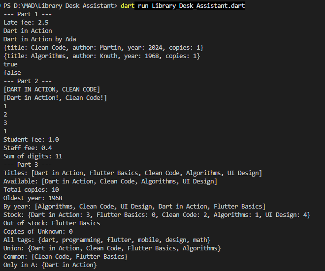
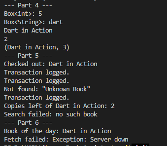

# CS442 — Library Desk Assistant

A pure Dart console-based library management exercise developed for **CS 442: Mobile Application Development (Fall 2026)**.

This project implements the programming concepts covered in **Week 3**, including functions and parameters, closures, higher-order functions, recursion, collections, generics, error handling, custom exceptions, and asynchronous programming with `Future` and `async/await`.

## 📚 Project Overview

The **Library Desk Assistant** simulates the back-end logic of a small campus library desk.

The program works with a collection of library books and demonstrates common operations such as:

* Calculating late fees
* Formatting book titles
* Creating book records
* Filtering available books
* Calculating total stock
* Sorting books by publication year
* Managing book stock
* Performing Set operations
* Using generic classes and functions
* Handling missing and unavailable books
* Simulating asynchronous book retrieval

This project is implemented entirely in **Pure Dart** and does not use Flutter UI.

## 🎯 Learning Objectives

The project demonstrates the following Dart concepts:

1. **Functions and Parameters**

   * Positional parameters
   * Optional positional parameters
   * Named parameters
   * Required parameters
   * Default parameter values
   * Arrow functions

2. **Closures and Higher-Order Functions**

   * Passing functions as arguments
   * Anonymous functions
   * Closures
   * Independent counters
   * Function factories

3. **Recursion**

   * Recursive function calls
   * Base cases
   * Digit processing using `%` and `~/`

4. **Collections**

   * `List`
   * `Map`
   * `Set`
   * `map()`
   * `where()`
   * `reduce()`
   * `fold()`
   * `sort()`
   * Set union, intersection, and difference
   * Collection-for

5. **Generics**

   * Generic classes
   * Generic functions
   * Multiple type parameters
   * Compile-time type safety

6. **Error Handling**

   * Custom exceptions
   * `throw`
   * `try`
   * `on`
   * `catch`
   * `finally`
   * `StateError`

7. **Asynchronous Programming**

   * `Future<T>`
   * `async`
   * `await`
   * Delayed operations
   * Handling asynchronous errors

## 🗂️ Project Structure

```text
Library Desk Assistant/
│
├── Library_Desk_Assistant.dart
└── README.md
```

### Main Dart File

**`Library-Desk-Assistant.dart`**

Contains the complete implementation of the Week 3 lab, including all six parts and reflection answers.

## 📖 Parts Covered

### Part 1 — Functions & Parameters

Implements:

* `lateFee()`
* `formatTitle()`
* `makeBook()`
* `isClassic()`

Demonstrates different Dart parameter types and arrow syntax.

### Part 2 — Closures, Higher-Order Functions & Recursion

Implements:

* `transformAll()`
* `makeCounter()`
* `makeFeeCalculator()`
* `sumDigits()`

Demonstrates functions as first-class objects, closures, anonymous functions, and recursion.

### Part 3 — Collections

Demonstrates:

* Extracting titles with `map()`
* Filtering available books with `where()`
* Calculating total copies with `fold()`
* Finding the oldest year with `reduce()`
* Sorting a copied list
* Building a stock `Map`
* Performing Set operations

### Part 4 — Generics

Implements:

* `Box<T>`
* `firstOr<T>()`
* `Pair<A, B>`

Demonstrates reusable and type-safe Dart code.

### Part 5 — Error Handling

Implements:

* `BookNotFoundException`
* `BookNotAvailableException`
* `checkOut()`
* `findBook()`

Demonstrates custom exceptions and structured exception handling.

### Part 6 — Future & Async/Await

Implements:

* `fetchBookOfTheDay()`
* `fetchBroken()`

Demonstrates delayed asynchronous operations and error handling with `try/catch`.

## 🛠️ Requirements

To run this project locally, you need:

* Dart SDK
* VS Code or another code editor
* Command-line terminal

Alternatively, the code can be executed using **DartPad**.

## ▶️ How to Run

Open a terminal in the project folder:

```bash
dart run Library-Desk-Assistant.dart
```

## ✨ Format and Analyze the Code

Format the Dart file:

```bash
dart format Library-Desk-Assistant.dart
```

Analyze the code for warnings and errors:

```bash
dart analyze Library-Desk-Assistant.dart
```

A successful analysis should report no issues.

## 🖥️ Expected Program Flow

When executed, the program displays six sections:

```text
--- Part 1 ---
--- Part 2 ---
--- Part 3 ---
--- Part 4 ---
--- Part 5 ---
--- Part 6 ---
```

Each section demonstrates a different Dart programming concept from the Week 3 lab.

## 📸 Submission

The course deliverables are:

1. `Library_Desk_Assistant.dart`
2. `screenshots/console-output.png`
3. `README.md`

### Console Output

The following screenshot shows the complete console output from Part 1 through Part 6:





The complete console screenshot should show the output from **Part 1 through Part 6**.

## 🎓 Course Information

**Course:** CS 442 — Mobile Application Development
**Semester:** Fall 2026
**Lab:**  Library Desk Assistant
**Programming Language:** Dart
**Development Type:** Pure Dart / Console Application
**Student:** Muhammad Rayyan Bhatti
**Roll No:** 04072312024

## 🧠 Reflection

The project also includes short reflection answers covering:

* When to use `fold()` instead of `reduce()`
* How closures capture variables
* Why specific exception handlers should come before general catches
* Why forgetting `await` produces a `Future` instead of the final result

## 🔐 Academic Note

This repository contains coursework developed for educational purposes as part of CS 442: Mobile Application Development.

---

**CS 442 — Mobile Application Development | Fall 2026**
